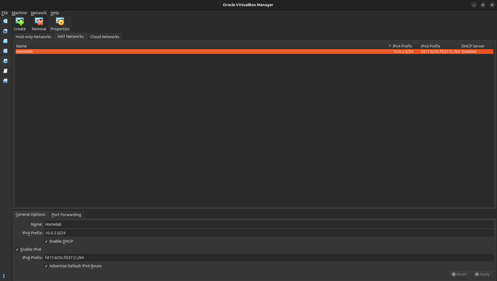
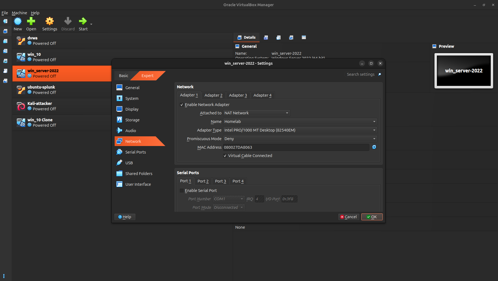

<h1>Networking Setup (NAT Network)</h1>

All virtual machines are connected using a VirtualBox NAT Network to allow
internet access and internal communication while remaining isolated from the
host LAN.

<h2>Why NAT Network</h2>
<ul>
  <li>Internet access for all VMs</li>
  <li>VM-to-VM communication</li>
  <li>Isolation from host LAN</li>
</ul>

<h2>Create NAT Network</h2>
<ul>
  <li>Open VirtualBox</li>
  <li>Go to <code>File → Tools → Network Manager</code></li>
  <li>Create a new NAT Network</li>
  <li>Set the network range to <code>10.0.2.0/24</code> (or any /24 range)</li>
  <li>Enable DHCP</li>
</ul>

<h2>Attach NAT Network to Virtual Machines</h2>
<ul>
  <li>
    Select the VM → Settings → Network → Adapter 1
  </li>
  <li>
    Choose <strong>NAT Network</strong>
  </li>
  <li>
    The network name will appear automatically
  </li>
</ul>

Now log in to the virtual machines and verify that networking is working.
Each VM should have internet access and be able to communicate with other
machines in the lab.

<h2>Verify Connectivity</h2>
<pre><code>ipconfig
ping 8.8.8.8 or 
ping any vm like -  10.0.2.5
</code></pre>

Static IP and custom DNS configuration are not required at this stage.

